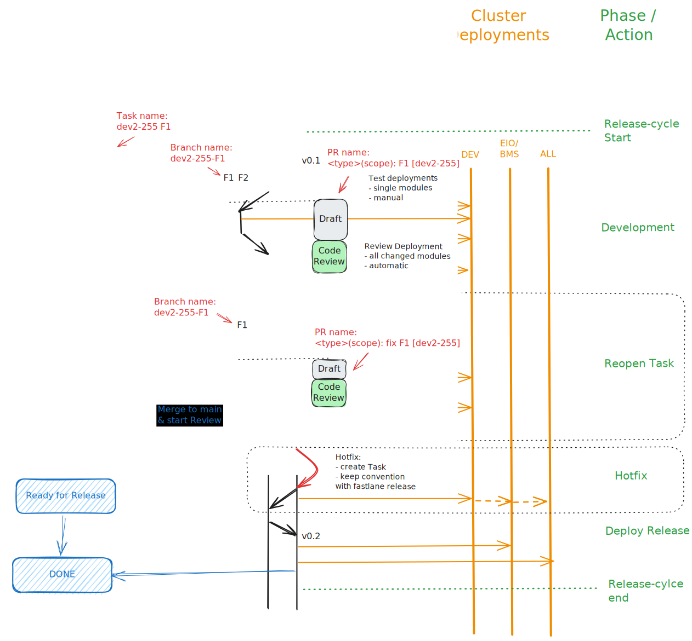

# efficientIO

# Technologies

- GitHub (code development and builds Docker images and apps)
- Terraform (set up the Exoscale infrastructure with code)
- Exoscale (provides VMs that run Kubernetes or our self-installed software)
- Longhorn (replicates hard disk to all nodes and ensures data safety due to redundancy, all the information is stored three times)
- Kubernetes (runs Docker images, document in **deployment.yaml** files)
- Vue (frontend library, code is in **console** folder)
- Angular (frontend library used for the dashboard, code is in **dashboard** folder)
- Go net/http (backend library, multiple microservices, in the other folders)

# Communication

- task specifications should be written down into JIRA
- task problems and help requests that make no sense to document in JIRA are handled via Teams video calls or chats

# People

- Hannes Brantner (mostly backend development, some frontend work)
- Johannes Pirker (frontend and backend development)
- Markus Gall (ai services development)
- Markus Schwarzmann (operations and hardware installation at the customers place)
- Mohammad Mostajab (programs BACNet to OPC UA mapper to replace oqdo)

# Nice to know

- Terraform was used to setup clusters, there are terraform state files in **./infrastructure/terraform/{CLUSTER_NAME}**.
- To apply a new state run the script **scripts/check_terraform.py** with either the mode **check** or **apply**.
- When adding a new node in Terraform, make sure the **label_ci_cd** is called to correctly label the nodes for the services, some services are only scheduled on big nodes.
- To check the whole workflow order and dependencies except basic cluster setup, check the script in **scripts/deploy_all_components_to_cluster.py**.
- common services not developed by us are in the **infrastructure** folder
- common tools that should be installed are in the **chocolatey** folder
- the only services that are reachable from outside (have a public IP) are **NGINX** and **CONSOLE** (all LoadBalancer services)
- some manual work was automized and made usable for others in the **scripts** folder (for example to migrate projects to a new cluster)
- there are currently six different Exoscale environments, which run the same software, the behavior is determined via environment variables that are passed to Kubernetes
- all code changes are deployed via GitHub Actions
- no code changes are deployed automatically, every code change must be deployed manually
- to set up a new cluster and deploy the services in the right order, take a look at **infrastructue/CLUSTER_SETUP.md**
- certificate handling is also explained in the **infrastructue/CLUSTER_SETUP.md** file
- to set up a new whitelabel, take a look at **console/WHITELABEL_SETUP.md**
- to develop locally, use the script **scripts/make_cluster_service_available_locally.py** and supply the service needed by the services from localhost by changing the environment variables and start the Go executables locally
- base64 encode files with **base64 -i {{file}} -w 0**

# Services

- admin (admin console)
- ai (ai module, seven ai services at the moment)
- api (CRUD operation API for all entities that is called by the console)
- connectivity (periodically checks if enabled projects have a hardware connected that have internet)
- console (used to build the website and the apps, the code for the user interface that is displayed to the user)
- controller (generates the pulses that are created by the time switch devices)
- dashboard (application that displays aggregated information about a configured project)
- dragino (script that runs on a Dragino gateway that collects and sends LORAWAN measurement data to our MQTT broker)
- empa (data interface for the ai module that makes requests to the database for time-series data)
- eventwatcher (software modules that imports/exports data from third parties like OQDO and Azure event hubs)
- flyway (batch job that makes sure the database version matches the file, must be triggered manually)
- grafana (monitoring tool, collects logs and metrics from Kubernetes, dashboards can be preconfigured in this folder)
- infrastructure (third-party modules that are used like kubernetes dashboard, Loki for log collection, Longhorn, Minio for document storage like images, mosquitto as MQTT broker, Lynus namespace, NGINX as reverse proxy, node-exporter exports metrics of the node like CPU usage and HDD usage, Postgres is the TimescaleDB service, Prometheus is the tool that collects the metrics from the metrics endpoints and sends them to Grafana, Redis as fast in-memory database for example for variable to id conversion, secrets configure all Lynus secrets)
- keepass (used to store secrets for services or accounts used during operations)
- keycloak (used for user authentication management, user login and token validation)
- projects (SPS projects installed at the customers)
- proxy (handles authentication and rate limiting to the MQTT broker)
- publisher (published project coordinates to MQTT)
- recorder (saves MQTT messages to the database)
- report (service that builds reports, for example a report for gas usage in October with a price per consumed unit)
- rule (engine that checks if the rules that are configured for the project are valid and if not executes the configured actions)
- smartmeter (API for importing third-party smart meter measurements)
- sps (library code for the SPS projects)

## Dev setup using docker

1. copy `.env.example` as `.env`
2. add all variables which are missing
3. run `docker compose up -d --build`

# Dev Process



### What to do if changes are necessary to an already merged PR? 

1. go to the ticket in Jira and open a new Branch from there. Make sure the ticket-id is included e.g. DEV2-183-xxx
2. commit new changes to this branch
3. open new PR on this branch

This way the Jira Task will hold both PRs

# Naming Convention

## Conventional Commits

### Template

```git
commitType(scope) commitMessage
```

### Commit types

- build
  - Changes that affect the build system or external dependencies (example scopes: gulp, broccoli, npm)
- ci
  - Changes to CI configuration files and scripts (example scopes: Travis, Circle, BrowserStack, SauceLabs)
- chore
  - Changes which doesn't change source code or tests e.g. changes to the build process, auxiliary tools, libraries
- docs
  - Documentation only changes
- feat
  - A new feature
- fix
  - A bug fix
- perf
  - A code change that improves performance
- refactor
  - A code change that neither fixes a bug nor adds a feature
- revert
  - Revert something
- style
  - Changes that do not affect the meaning of the code (white-space, formatting, missing semi-colons, etc)
- test
  - Adding missing tests or correcting existing tests

test