# How the project is structured

1. We use the [sinergym simulator](https://github.com/ugr-sail/sinergym) to simulate a building including its heating
   and cooling system.
2. Additional documentation can be found
   here [here](https://ugr-sail.github.io/sinergym/compilation/main/pages/installation.html).
3. The simulator is Python library and consists of a building file and a weather file.
4. The controller is a PID controller built from this [library](https://readthedocs.org/projects/simple-pid/).
5. This controller needs three parameters which should be autotuned by [optuna](https://optuna.org/).
6. Each building uses a heating system that can be controlled by setting the output water temperature into the heating
   system.
7. The controller gets the indoor temperature as input and produces the targeted output water temperature into the
   heating system.
8. The target temperature should be adjustable for each weekday and for time ranges within that weekday, also a holidays
   should be treated as special weekdays.
9. The PID controller can be improved because we know some disturbance variables like outdoor temperature and sun
   radiation (diffuse and direct, maybe the sum is enough), incorporate wind and humidity later.
10. We also know the disturbance variables in the future with also forecasting API, up to one day forecasting is
    possible.

# How to use this testing module

1. Create the Docker image with the Dockerfile that is in this folder with this command

~~~~ 
docker build -t build/setpoint . 
~~~~

A image named build/setpoint is getting created. This image can now be used for normal programming
and also for programming in jupyter notebook

2. For normal programming setup a Python interpreter from a Docker image using
   [PyCharm](https://www.jetbrains.com/help/pycharm/using-docker-as-a-remote-interpreter.html)
   or [VSCode](https://gist.github.com/alvarocavalcanti/24a6f1470d1db724a398ea6204384f00)
3. For programming in jupyter notebook use this tutorial in Pycharm.

- First start the docker via this command

~~~~
docker run -p 8888:8888 build/setpoint 
~~~~  

Now the docker is running on the port 8888 and can also be reached via the browser. The used Token is written, right
now, in
the Dockerfile to look at.

- To configure the jupyter server in Pycharm go to Tools -> Add jupyter Connection and add the server like this:
  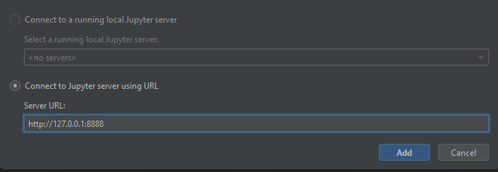
- Enter the token and the connection will be established
- On the Project side there should be now a connection to the jupyter server like this
  
- Use that to code on the notebook!

4. For programming in jupyter notebook use this tutorial for VSCode.

- It is important to have installed "Dev Containers" in VSCode
- In the bottom left we can see if VSCode is already connected to the container in this example it isn't yet
  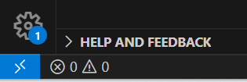
- To create a connection go to the Remote Explorer and when installed correctly it should show all Container
  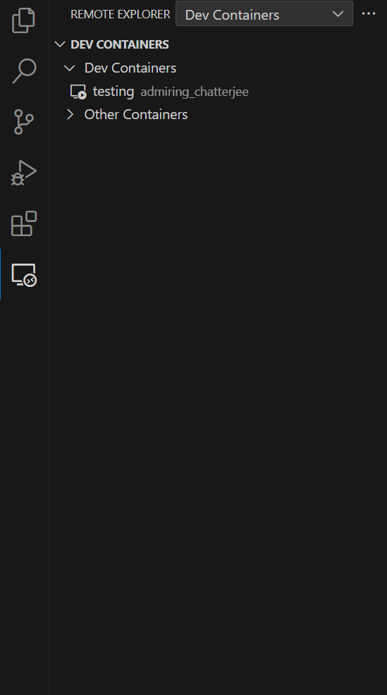
- In this example the image is still called testing and if the docker is running we see a little play sign in the icon
- By hovering over the running docker we can open the connection in this window or open a new one
- When connected it should now show in the bottom left that it is connected
- Now go to the Explorer and you should see that no Folder is opened. So press "Open Folder" and enter it like this
  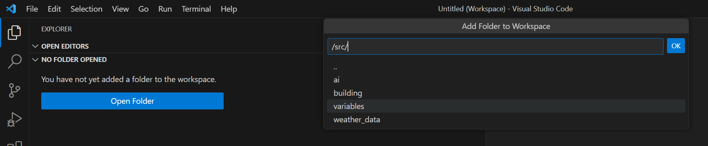
- After pressing "ok" it should open the folder source with the notebook in it.

# Test Deploy Optimization

use the *Run_deploy_testbench.ipynb* notebook. For running an optimization similar to when deployed, you can use the
notebook as full interface to the setpoint optimizer, everything should be configurable there.

#### Considerations

At the time of writing, the notebook is set to start a new trial every 12 hours with the working day starting at 8.00
and ending at 18.00. This means even trials test a rising setpoint change (20°C before the 8.00 edge and 23°C after the
8.00 edge), odd trials test a falling setpoint change at 18.00.

This is not a fair comparison as falling edges can not be followed by the used actuator (=heating up boiler water
temperature) but rather the room needs to cool down on its own.
We considered extending the trial to 24 hours, making each day the same. However, we came to the conclusion, that even
days are not comparible as week days differ a lot from weekends. Even Monday mornings will differ a lot from saturday
mornings for example.

Conclusive, we stayed with the initial setup but keep this consideration together with monitoring the behavior when
live.

# Building File Setup

**HVAC 5Zone Heat Only**

Notes:

- Check out
  the [Energy Plus Input Output Reference](https://bigladdersoftware.com/epx/docs/9-0/input-output-reference/index.html)

- Keep in Mind that there might be more variables which need to be set to constant values to ensure controlled and
  undisturbed operation.
- The following guide is not extensive. Checkout the screenshots for details.

1. Download HVACTemaple-5ZoneVAVWaterCool.idf from https://github.com/NREL/EnergyPlus/tree/develop/testfiles

2. Change HVACTemaple-5ZoneVAVWaterCool.idf to HVACTemplate-5ZoneWaterHeatUnitary.idf by:
    - Changing VAV components to Unitary components

   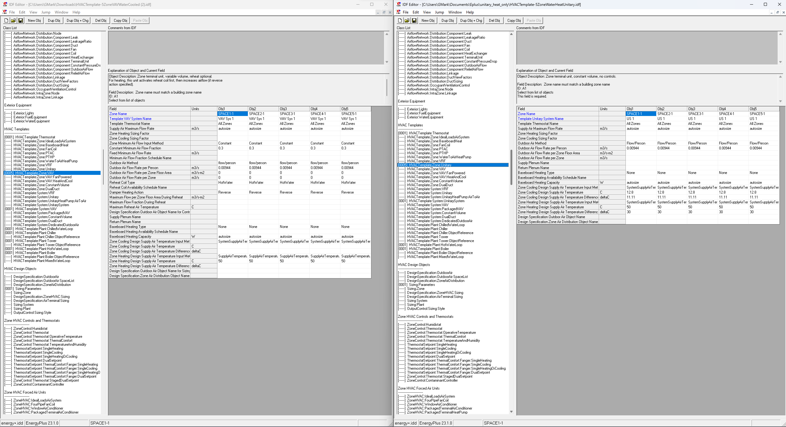
    - Removing Reheat Coils
    - Removing Cooling Coils
      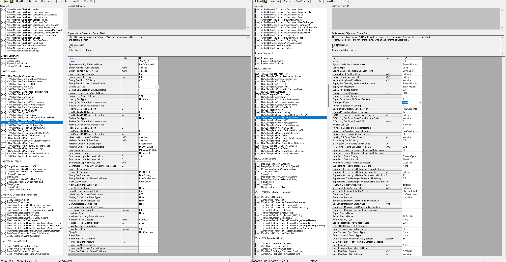

    - Constant Water Pump (ensures constant water flow)
      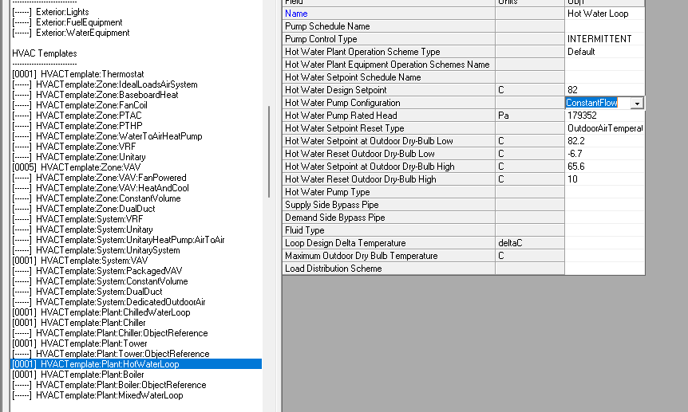

3. Run EnergyPlus simulation to get HVAC-5ZoneWaterHeatUnitary.idf file. In this idf-file the HVAC Template are
   translated to its single components building the system.

4. Convert to epJSON -> HVAC-5ZoneWaterHeatUnitary.epJSON

5. Make the following changes in the epJSON file:
    - Remove Zone Conrol Thermostats
      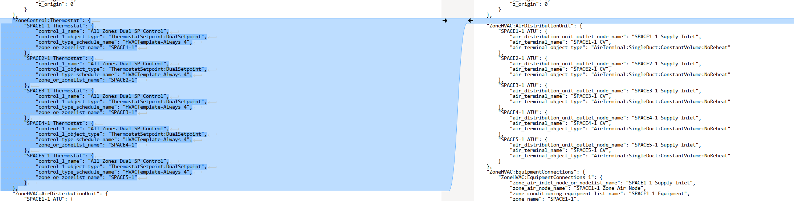

    - Change AirReset with Scheduled Setpoint Manager (This is where our action links to)
      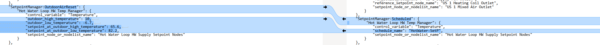
    - Bypass Thermostat by setting Unitary control type to "SetPoint"
      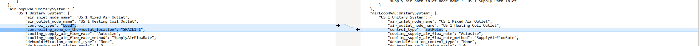
    - Change all compact schedules to run a constant value 24/7
    - Remove all managers

6. Make sure that variables are set to constant wherever possible
7. Copy the epJson and the created rdd file into the building and variables folder respectively.
8. Add Control to actuators by following the next section.

# How add buildings with flow temperature

1. In [Github](https://github.com/NREL/EnergyPlus/tree/develop/testfiles) there are different test buildings. In the
   first
   case we took the HVACTemplate-5ZoneVAVWaterCooled.idf file. And to check if it is possible to set the flow
   temperature it
   needs to have a hotwaterloop in the file.
2. Now to use it for this program we need to check If the Building is a HVACTEMPLATE, because it is a special case we
   need to preprocess it first.
   Install Energyplus on your own Computer and simulate in once. The Program creates a .expidf file, just change it to a
   idf file let it convert with the ConvertInputFormat file and then a epJSON file was created.
3. When Converted add it to the buildings folder and the rdd file that also gets generated add it to the variables
4. To add a new input into the epJSON file we need to add the nodes to the SetpointManager:Scheduled.
   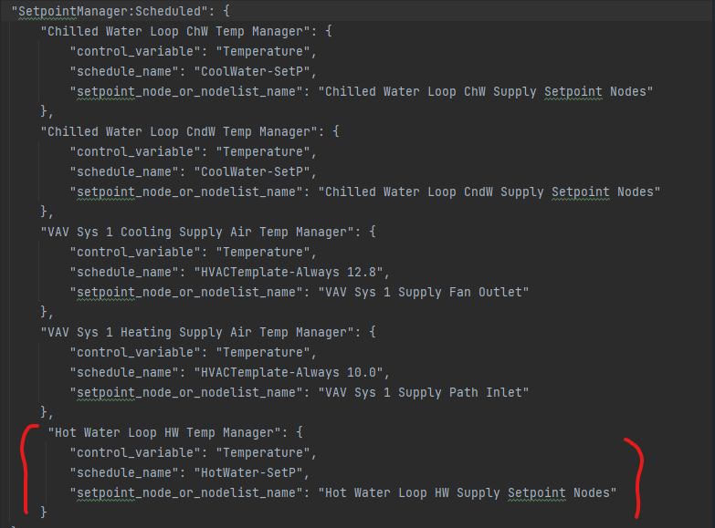
5. Important is that the schedule_name is set, with the right name that we can set ourself. In this example our variable
   names are “HotWater-SetP” and “CoolWater-SetP”. Next we need to set the scheduler in the epJSON, so that when we do
   not set it in the program it still gets set in a scheduled way. Here a small example how it looks like:
   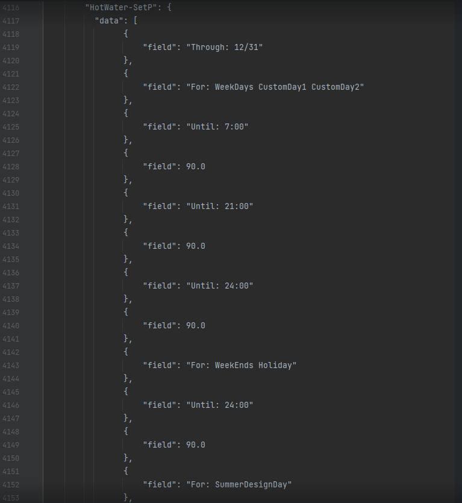
6. To check if it set correctly, we can debug with env.schedulers() to get all variables that can be set in the action
   mapping.

# Additional Resources

- Notes on Simulation Setup, Evaluation Results and more: OneNote PID Controller (here)
- Usage examples: IPY Notebooks (here)
- Simulation Detailed
  Documentation: [Energy Plus Input Output Reference](https://bigladdersoftware.com/epx/docs/9-0/input-output-reference/index.html)