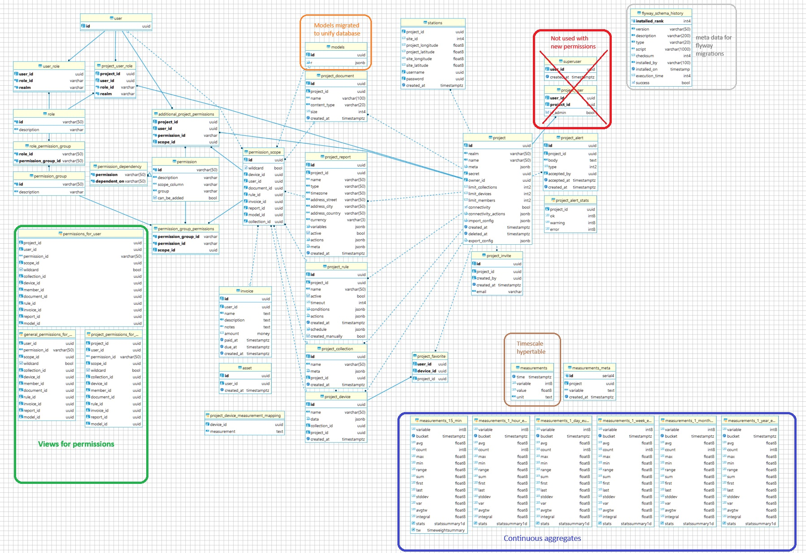

# flyway

This custom docker container is used to set up databases and apply the up-to-date schema
This component also updates the timescale extension used in the database container

## DB Schema

## Add migration

to add an migration add an file into the database that should be changed (e.g.: `lynus`). The file has to start with `Vxx__`, where `xx` is the next version.
