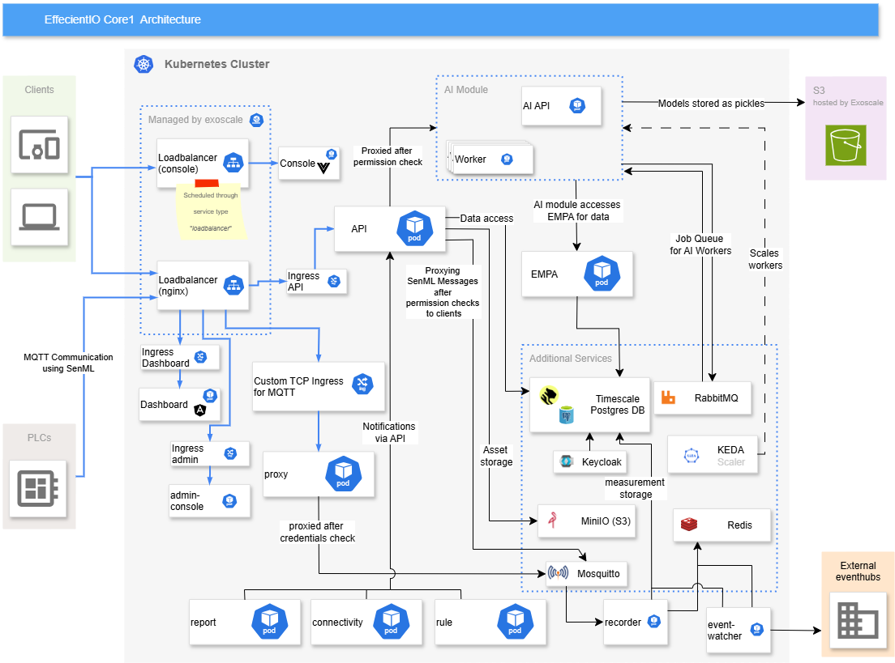
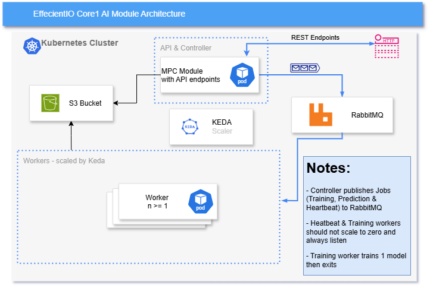
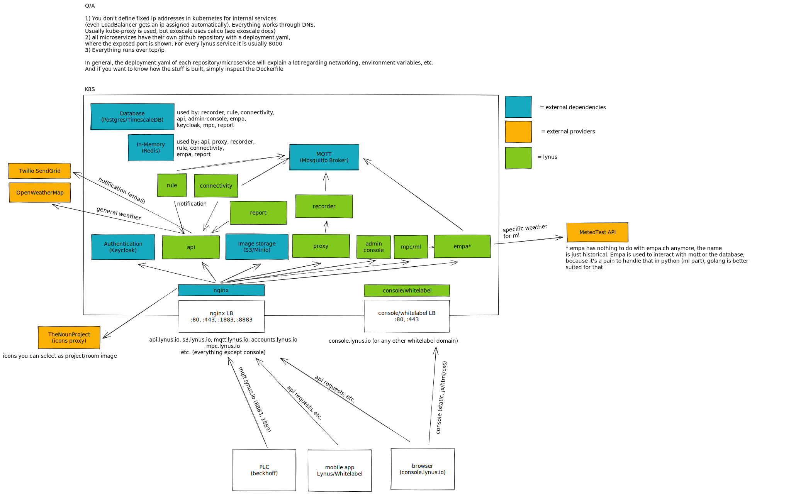

# Infrastructure


This repository contains the main parts for bringing up the Lynus infrastructure. Currently everything has to be done by
hand, but in the future an ansible/terraform script might be more appropriate.

## AI architecture



## Deployment

- Create a Kubernetes cluster (k3s, managed kubernetes, whatever). Make sure that RWX storage classes are
  available `kubectl get storageclass`.
- Create `deployments/ghcr.yaml` with your docker credentials for your container registry (ghcr, etc.)
- Create `deployments/lynus-credentials.yaml` with your desired credentials
- Create `deployments/lynus-io-tls.yaml` with your bought wildcard certificate (`*.<domain>`) and a self-signed
  certificate for `mqtt.<domain>`. The validity for the self-signed certificate should be something like 10 years or
  more. This certificate will only be used for tcp clients that connect to mqtt over
  8883 (https://stackoverflow.com/a/10176685)
- Start bringing up all other main services: `deployments/<minio, mosquitto, nginx, postgres, redis>`
- Apply the SQL schema for `postgres` using flyway and the scripts under `flyway/sql/*`
- Create two buckets for `minio` named: `assets, documents`
- Start bringing up other services via GitHub (api, rule, connectivity, etc.)
- Create keycloak realm, etc. (more information in the KeyCloak repository)

# Whitelabel creation

- Create a new realm in Keyloak, see `README.md` of the keycloak repository
- Add the whitelabel domain/configuration in `config.json` in the console repository (console `README.md` for more
  information)
  - Make sure that the whitelabel domain, e.g. `mywhitelabel.whitelabel.com` points to the ip address of the console
    loadbalancer (`kubectl get service`), a CNAME to `console.lynus.io` should also work. Let's Encrypt
    certificates will be generated automatically
- App whitelabel/flavor creation, building, deployment: see `README.md` of app repository

Nothing has to be changed in the code, because the realm/whitelabel will be extracted from the JWT when authenticating
the user.

## Issues

1. It can happen that `nginx` won't start because it cannot resolve dns names of non-existent services yet, but after
   getting up all services simply restart the nginx pod

## Problems with cluster

1. To get the cluster back to a consistent state with no completed or failed pods you can execute the following two
   commands:

```bash
kubectl delete pod --field-selector=status.phase==Succeeded -n lynus
kubectl delete pod --field-selector=status.phase==Failed -n lynus
```

## Restart deployments in a cluster

1. Prefer the use of rollout restart (this does not cause downtime):

```bash
kubectl --kubeconfig efficientio_kube_config_cluster.yml rollout restart deployment keycloak -n lynus
```

2. otherwise use this trick to scale the deployment down to 0 and then back to the original amount of replicas (most
   often 1),
   example for sftp:

```bash
kubectl scale --replicas=0 deploy sftp -n lynus
kubectl scale --replicas=1 deploy sftp -n lynus
```

Please keep in mind that this operation leeds to some downtime!

## Get access to a database backup with any sql client

- Forward the longhorn ui to localhost:7000 using this command:

```bash
kubectl --kubeconfig config.yml port-forward deployment/longhorn-ui 7000:8000 -n longhorn-system
```

- Restore the backed up database files to a kubernetes volume called "databaserestore" using the longhorn ui, this takes
  some time
- Create a pv/pvc from the restored volume called "databaserestore" using the longhorn ui
- Connect a timescale container to the created pvc using the command:

```bash
kubectl --kubeconfig config.yml apply -f .\infrastructure\deployment\postgres\backup\deployment.yaml
```

- Forward the service using the command:

```bash
kubectl --kubeconfig config.yml port-forward deployment/databaserestore 7000:5432 -n lynus
```

- Connect to the database using the lynus credentials and your preferred sql client
- When done inspecting the data, delete the timescale container:

```bash
kubectl --kubeconfig config.yml delete -f .\infrastructure\deployment\postgres\backup\deployment.yaml
```

- Then delete the restored volume in the longhorn ui, this will also delete the pv/pvc associated to the volume

## Old Diagram


