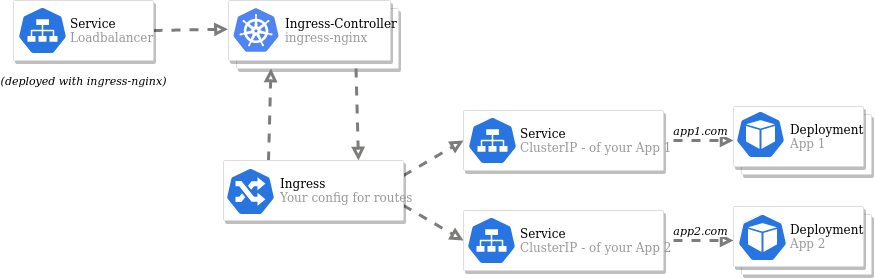

# Ingress-NGINX

Ingress Nginx is used for handling ingress to the cluster using Exoscales loadbalancers. Only the Console directly attaches to its own exoscale loadbalancer.



Ingress-NGINX is deploy using the `ingress.yaml` file. It is an adaption from the original deployment file from exoscale. See [exoscale docs](https://community.exoscale.com/documentation/sks/loadbalancer-ingress/) and kubernetes ingress [docs](https://kubernetes.github.io/ingress-nginx/deploy/#exoscale) as well as the [orignal installation yaml](https://raw.githubusercontent.com/kubernetes/ingress-nginx/main/deploy/static/provider/exoscale/deploy.yaml). It is also saved as `origina-ingress.yaml` for comparison.

## Ingress adaptions

Multiple adaptations were made to the original file provided by exoscale.

A config map was added for TCP Ingress (MQTT):

```yaml
---
apiVersion: v1
kind: ConfigMap
metadata:
  name: tcp-services
  namespace: ingress-nginx
data:
  8883: "lynus/mqtt-ssl-proxy:8883"
  1883: "lynus/mqtt-ssl-proxy:1883"
---
```

### Configmap

The data of the orignal config map was changed to:

```yaml
allow-snippet-annotations: "true"
http-snippet: "proxy_cache_path /tmp/nginx_cache levels=1:2 keys_zone=icons:10m max_size=10g  inactive=60m use_temp_path=off;"
```

### Service Loadbalancer

The following annotations were added to the service defintion of the load balancer

```yaml
service.beta.kubernetes.io/exoscale-loadbalancer-service-instancepool-id: "INSTANCEPOOL_ID"
service.beta.kubernetes.io/exoscale-loadbalancer-id: "LOADBALANCER_ID"
service.beta.kubernetes.io/exoscale-loadbalancer-name: ingress-nginx-controller
service.beta.kubernetes.io/exoscale-loadbalancer-external: "true"
```

Also the following ports were added

```yaml
- name: proxied-tcp-8883
      port: 8883
      targetPort: 8883
      protocol: TCP
- name: proxied-tcp-1883
    port: 1883
    targetPort: 1883
    protocol: TCP
```

And the selector was added

```yaml
app.kubernetes.io/part-of: ingress-nginx
```

### Controller daemon set

The following flags were added to the arguments for the controller daemon set.

```yaml
- --default-ssl-certificate=lynus/tls-certificates
- --tcp-services-configmap=ingress-nginx/tcp-services
```

## Cert-manager

For certficates cert manager is used. It can automatically (re-)create certs using lets encrypt. It is deployed using `cert-manager.yaml`. More information about the installation can be found [here](https://cert-manager.io/docs/installation/). For lets encrypt the `prod-issuer.yaml` creates a cluster issuer (for testing the `stating-issuer.yaml` can be used).

## Ingress / Proxying

THe proxy all the requests accordingly the `reverse-proxy.yaml` is used. It creates ingresses and adds some specific configurations to them.

## MQTT adaptions

In order for the SSL Termination of the MQTT Broker an mqtt-proxy was added. It is deployed using `mqtt-ssl-proxy.yaml`.

## Required DNS entries for domain "DOMAIN.COM"

### LoadBalancer-IP of Kubernetes Service "console-lb" = CONSOLE-LB-IP

### LoadBalancer-IP of Kubernetes Service "nginx-lb" = NGINX-LB-IP

- CONSOLE_URI / CONSOLE-LB-IP
- accounts.DOMAIN.COM / NGINX-LB-IP
- admin.DOMAIN.COM / NGINX-LB-IP
- api.DOMAIN.COM / NGINX-LB-IP
- mqtt.DOMAIN.COM / NGINX-LB-IP
- s3.DOMAIN.COM / NGINX-LB-IP
- static.DOMAIN.COM / NGINX-LB-IP
- monitoring.DOMAIN.COM / NGINX-LB-IP

**using own cert**

- mqtt.DOMAIN.COM / NGINX-LB-IP
